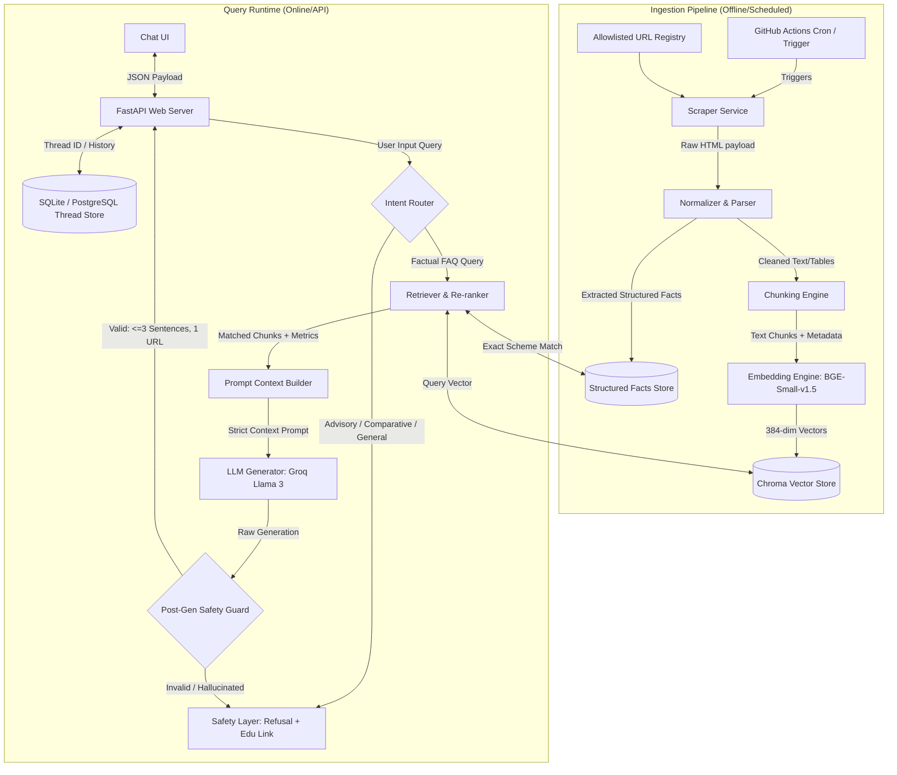

# System Architecture: Mutual Fund FAQ Assistant (Facts-Only Q&A)

This document describes the detailed system architecture for the **Facts-Only Mutual Fund FAQ Assistant** as defined in [problemStatement.md](file:///c:/Users/Gaurav%20Kumar/Desktop/MF-CHATBOT/docs/problemStatement.md). 

The core goal of this architecture is **absolute accuracy, strict compliance, and clear data provenance (citations)** over conversational flexibility. The chatbot retrieves facts only from a closed allowlist of 5 HDFC mutual fund scheme pages on Groww and refuses any advisory or comparative queries.

---

## 1. Architectural Design Principles

| Principle | Architectural Decision |
| :--- | :--- |
| **Facts-Only Compliance** | The assistant is structured as a **closed-book RAG system**. It can only respond using the context retrieved from the allowlisted corpus. |
| **Strict Provenance** | Every response must cite **exactly one** canonical source URL from which the information was retrieved. |
| **Zero Investment Advice** | Pre-retrieval routing and post-generation safety layers block, refuse, and redirect any advisory, opinionated, or comparative user queries. |
| **Zero PII Leakage** | Interaction payloads are anonymous; no personal or financial details (like PAN, Aadhaar, account numbers, or phone numbers) are collected or logged. |
| **Accuracy > Intelligence** | The assistant prefers to politely refuse or state that it cannot find the information in the corpus rather than attempting to guess or generalize. |

---

## 2. High-Level System Components

The system is split into two decoupled processes: **Ingestion** (offline pipeline running on a schedule) and **Query Runtime** (online API and UI flow).



---

## 3. Data Scope & Model

### 3.1 Curated Allowlist Corpus
The assistant's corpus is strictly limited to the following 5 scheme URLs:
1. **HDFC Mid-Cap Opportunities Fund Direct Growth**: `https://groww.in/mutual-funds/hdfc-mid-cap-fund-direct-growth`
2. **HDFC Top 100 Fund Direct Growth**: `https://groww.in/mutual-funds/hdfc-large-cap-fund-direct-growth`
3. **HDFC Small Cap Fund Direct Growth**: `https://groww.in/mutual-funds/hdfc-small-cap-fund-direct-growth`
4. **HDFC Gold ETF Fund of Fund Direct Plan Growth**: `https://groww.in/mutual-funds/hdfc-gold-etf-fund-of-fund-direct-plan-growth`
5. **HDFC Defence Fund Direct Growth**: `https://groww.in/mutual-funds/hdfc-defence-fund-direct-growth`

### 3.2 Dual-Data Model (Hybrid Store)
To ensure reliable recovery of factual metrics (like NAV or expense ratios) and detailed unstructured text (like fund manager details), the ingestion pipeline writes to two distinct storage formats:

1. **Structured Facts Store (JSON / PostgreSQL)**:
   Stores exact key-value facts extracted from the page.
   * `scheme_id` / `scheme_name`: Unique identifier.
   * `source_url`: Groww URL.
   * `fetched_at`: Timestamp of extraction.
   * `nav`: Net Asset Value (e.g. `₹152.45`).
   * `minimum_sip`: Minimum SIP contribution (e.g. `₹100`).
   * `fund_size_aum`: Assets Under Management (e.g. `₹25,430 Cr`).
   * `expense_ratio`: Percentage fee (e.g. `0.65%`).
   * `riskometer`: Classification (e.g. `Very High Risk`).
   * `benchmark`: Benchmark index (e.g. `NIFTY Midcap 150 TRI`).
   * `fund_managers`: List of strings representing fund managers.

2. **Vector Index (Chroma DB - Local Persistence)**:
   Stores split text chunks for semantics-based retrieval.
   * **Vector Dimension**: `384` (using `BAAI/bge-small-en-v1.5`).
   * **Distance Metric**: Cosine Similarity.
   * **Metadata Fields per Vector**:
     * `chunk_id`: Deterministic hash of chunk content.
     * `source_url`: Cited source URL.
     * `scheme_name`: Targeted scheme.
     * `fetched_at`: Crawled date.

---

## 4. Detailed Component Specifications

### 4.1 Ingestion Pipeline
* **Scheduler**: A scheduler (configured via GitHub Actions or equivalent runner) that triggers the ingestion component daily to fetch the latest data from the target sources. It runs daily at **10:00 AM** (e.g. `30 4 * * *` UTC / 10:00 AM IST), with `workflow_dispatch` enabled for manual triggers.
* **Scraper**: A rate-limited client fetching allowlisted HTML pages using a custom User-Agent identifying the project.
* **Parser & Normalizer**: Extracts the primary content body and JSON datasets (like `__NEXT_DATA__` blobs from Groww) to capture structured facts, removing navigation bars, footer boilerplate, and ads.
* **Chunker**: Splits text into **300–450 token chunks** using a structure-aware method (preserving tables and bullet points intact, e.g. keeping fund manager profiles and their experience/education in a single chunk).
* **Vector Persistence**: Uses `chromadb.PersistentClient` saving to `data/chroma/`. Upsert operations are based on `chunk_id` to prevent duplicates.

### 4.2 Query Runtime & Router
1. **API Server**: Built with **FastAPI** (`runtime/phase_9_api/`) exposing endpoints for chat session threads and message posting.
2. **Pre-Retrieval Intent Router**:
   * Classifies queries into `FACTUAL`, `ADVISORY`, `COMPARATIVE`, or `OUT_OF_SCOPE` using keyword rules or a lightweight classifier.
   * If `ADVISORY` or `COMPARATIVE` (e.g., *"Which fund is better?"* or *"Should I invest in HDFC Mid-cap?"*), the query bypasses the vector search and executes a direct refusal response with a pre-configured educational link (e.g., AMFI Investor Education portal).
3. **Hybrid Retrieval**:
   * If `FACTUAL`, performs dense retrieval in Chroma for semantic matching (using BGE-small embedding for the user's query).
   * Identifies if the query targets structured metrics (e.g., *"What is the exit load of HDFC Small Cap?"*), combining vector matches with structured metadata.
   * Chooses the **single highest-ranking source URL** from retrieved chunks to serve as the canonical citation link.

### 4.3 Generation & Guardrails
* **Context Prompting**:
  Presents the LLM (Groq API, Llama 3) with retrieved text segments under strict instruction headers:
  ```text
  You are a Facts-Only FAQ Assistant. Answer the query using ONLY the context provided below.
  If the context is insufficient, state that you cannot find the details in the indexed sources.
  
  CONTEXT:
  Source URL: [URL]
  Content: [Scraped text / fund manager profiles / table facts]
  
  RULES:
  1. Do NOT suggest or recommend any investment actions.
  2. Answer in 3 sentences or fewer.
  3. Include exactly one markdown source link matching the Cited Source URL.
  4. End with the footer: "Last updated from sources: YYYY-MM-DD"
  ```
* **Post-Generation Safety Guards**:
  A validation module inspects the generated text:
  * Counts sentences to ensure `<= 3`.
  * Verifies presence of **exactly one** URL, which must exist on the allowlist.
  * Rejects outputs containing speculative or advisory language (e.g. *"recommend"*, *"you should"*, *"good returns"*).
  * If validation fails, it triggers a single retry with a stricter system prompt, failing back to a static pre-formatted response containing the scheme's main URL if the second attempt also fails.

### 4.4 Multi-Thread Chat Management
* SQLite database storing session-level message logs (`runtime/phase_8_threads/`).
* Message Schema: `id`, `thread_id`, `role` (user/assistant), `content`, `timestamp`, `citation_url`.
* History window is capped at the last **N (4–6) turns** to prevent mixing context or diluting retrieval focus.
* A query expansion step rewrites follow-up messages (e.g. *"Who manages it?"* -> *"Who manages HDFC Mid-Cap Opportunities Fund?"*) based on previous user prompts in the active thread.

---

## 5. Technology Stack Summary

| Layer | Choice |
| :--- | :--- |
| **Deployment / CI** | GitHub Actions (daily scheduled ingest + manual trigger) |
| **Ingestion Storage** | Local JSON (structured metadata) & Raw HTML file store |
| **Vector Database** | **Chroma DB** (`PersistentClient` running locally at `data/chroma/`) |
| **Embeddings** | **`BAAI/bge-small-en-v1.5`** (384 dimensions, locally run) |
| **Large Language Model** | **Groq API** (Llama 3 family for fast, instruction-following generation) |
| **Backend API** | **FastAPI** + Uvicorn web server |
| **Thread Database** | SQLite (development) / PostgreSQL (production) |
| **Frontend UI** | Next.js (React) or static HTML/Vanilla JS with Vanilla CSS styling |

---

## 6. Known Architectural Limitations
* **Crawl Delays**: Scheme metrics and fund manager profiles are correct as of the latest daily scraper execution (indicated by the footer date).
* **Table Extraction limits**: Parsing unstructured web tables can occasionally result in chunk boundary splits; mitigated by structured fact extraction.
* **No Real-Time Market Feed**: The system relies purely on static crawlers; intraday NAV changes are not reflected in real-time.
